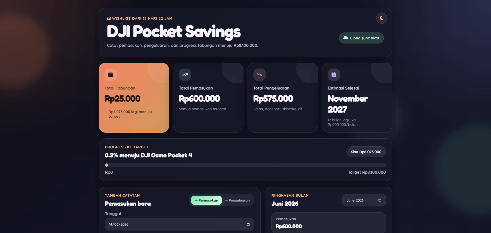

# DJI Pocket Savings Tracker 

<p align="center">
  
  
  
</p>

<p align="center">
  Tracker tabungan pribadi untuk mencatat pemasukan, pengeluaran, dan progress menuju wishlist impian.
</p>

<p align="center">
  <b>Target:</b> Rp8.100.000 • <b>Rencana nabung:</b> Rp500.000/bulan • <b>Mode:</b> Local / Cloud Sync
</p>

---

## Preview





---

## Tentang Project

**DJI Pocket Savings Tracker** adalah website sederhana untuk memantau progress tabungan menuju target tertentu.
Awalnya dibuat untuk target membeli DJI Pocket, tapi bisa juga dipakai untuk wishlist lain seperti kamera, laptop, HP, sepeda, atau kebutuhan pribadi.

Website ini dibuat menggunakan **HTML, CSS, dan JavaScript murni**, jadi bisa langsung di-host di **GitHub Pages** tanpa backend tambahan.

Untuk penyimpanan data, project ini mendukung dua mode:

* **Mode lokal** menggunakan `localStorage`
* **Mode cloud** menggunakan Supabase RPC + `vaultKey`

---

## Fitur Utama

* Catat pemasukan dan pengeluaran
* Total tabungan otomatis dihitung
* Progress bar menuju target
* Estimasi waktu selesai berdasarkan nominal tabungan bulanan
* Ringkasan pemasukan dan pengeluaran per bulan
* Format nominal otomatis ke Rupiah
  Contoh: `1000000` menjadi `Rp1.000.000`
* Kategori transaksi harian
* Export data ke JSON
* Import data dari JSON
* Cloud sync tanpa login email menggunakan Supabase
* Tampilan dark glassmorphism
* Responsive untuk desktop dan mobile

---

## Kategori Transaksi

Kategori bisa diubah langsung dari file `script.js`.

Contoh kategori harian yang disarankan:

```js
const categoryOptions = [
  "Uang Bulanan",
  "Tabungan",
  "Makan & Jajan",
  "Transportasi",
  "Kebutuhan Sekolah",
  "Pulsa & Internet",
  "Topup e-Wallet",
  "Hiburan",
  "Kesehatan",
  "Skincare",
  "Tarik Tunai",
  "Lainnya"
];
```

---

## Struktur File

```txt
.
├── index.html
├── style.css
├── script.js
├── database.sql
└── README.md
```

| File           | Fungsi                                                  |
| -------------- | ------------------------------------------------------- |
| `index.html`   | Struktur halaman website                                |
| `style.css`    | Tampilan, animasi, responsive layout                    |
| `script.js`    | Logic transaksi, format Rupiah, Supabase, export/import |
| `database.sql` | Schema dan function Supabase                            |
| `README.md`    | Dokumentasi project                                     |

---

## Cara Menjalankan Secara Lokal

Clone repository:

```bash
git clone https://github.com/takashivin/tabungan.git
cd tabungan
```

Lalu buka file:

```txt
index.html
```

Atau jalankan local server sederhana:

```bash
python -m http.server 3000
```

Buka di browser:

```txt
http://localhost:3000
```

---

## Deploy ke GitHub Pages

1. Upload semua file ke repository GitHub.
2. Masuk ke **Settings** repository.
3. Buka menu **Pages**.
4. Pada bagian **Build and deployment**, pilih:

   * Source: `Deploy from a branch`
   * Branch: `main`
   * Folder: `/root`
5. Klik **Save**.
6. Website akan aktif di link seperti ini:

```txt
https://USERNAME.github.io/NAMA_REPOSITORY/
```

---

## Setup Cloud Sync dengan Supabase

Project ini bisa berjalan tanpa login email.
Cloud sync dilakukan menggunakan Supabase RPC dan `vaultKey`.

### 1. Buat Project Supabase

Buka Supabase, lalu buat project baru.

Setelah project selesai dibuat, ambil:

* Project URL
* Publishable anon key

---

### 2. Jalankan SQL

Buka:

```txt
Supabase Dashboard > SQL Editor
```

Lalu copy isi file:

```txt
database.sql
```

Klik **Run**.

Jika berhasil, data akan disimpan di tabel:

```txt
savings_transactions
```

---

### 3. Isi Config di `script.js`

Buka file `script.js`, lalu ubah bagian ini:

```js
const CONFIG = {
  targetAmount: 8100000,
  monthlySaving: 500000,
  supabaseUrl: "https://PROJECT_KAMU.supabase.co",
  supabaseAnonKey: "sb_publishable_...",
  vaultKey: "kode-rahasia-panjang-kamu"
};
```

Keterangan:

| Config            | Fungsi                                 |
| ----------------- | -------------------------------------- |
| `targetAmount`    | Target tabungan                        |
| `monthlySaving`   | Rencana tabungan per bulan             |
| `supabaseUrl`     | URL project Supabase                   |
| `supabaseAnonKey` | Publishable key dari Supabase          |
| `vaultKey`        | Kode vault agar data antar device sama |

Gunakan `vaultKey` yang sama di semua device supaya datanya tersinkron.

---

## Mode Local vs Cloud

### Mode Local

Jika config Supabase belum diisi, website otomatis berjalan dalam mode lokal.

Data disimpan di browser menggunakan:

```txt
localStorage
```

Kelebihan:

* Tidak perlu Supabase
* Bisa langsung dipakai
* Cocok untuk testing

Kekurangan:

* Data hanya ada di browser tersebut
* Kalau cache/browser dihapus, data bisa hilang

---

### Mode Cloud

Jika config Supabase sudah benar, website otomatis masuk ke mode cloud.

Kelebihan:

* Data bisa sama di beberapa device
* Cocok untuk dipakai jangka panjang
* Bisa backup dari Supabase

Kekurangan:

* Perlu setup Supabase
* `vaultKey` di frontend bisa dilihat jika repository/site publik

---

## Export dan Import Data

### Export JSON

Gunakan tombol:

```txt
Export JSON
```

Data akan diunduh sebagai file `.json`.

### Import JSON

Gunakan tombol:

```txt
Import JSON
```

Pilih file backup JSON yang sebelumnya sudah diexport.

Fitur ini berguna untuk:

* Backup manual
* Pindah device
* Restore data jika browser terhapus
* Migrasi dari mode lokal ke cloud

---

## Catatan Keamanan

Project ini dibuat agar simpel dan mudah dipakai.

Karena menggunakan GitHub Pages, semua file frontend seperti `script.js` bisa dilihat oleh orang lain jika repository atau website bersifat publik.

Artinya:

* `supabaseUrl` boleh ada di frontend
* `supabaseAnonKey` memang publishable
* `vaultKey` jangan dianggap benar-benar rahasia jika ditaruh di frontend

Jangan gunakan mode ini untuk data yang sangat sensitif.

Untuk keamanan yang lebih kuat, gunakan sistem login seperti:

* Supabase Auth
* Email login
* OAuth
* Backend server sendiri

---

## Custom Target

Kamu bisa mengubah target dan nominal tabungan bulanan di `script.js`.

Contoh:

```js
const CONFIG = {
  targetAmount: 10000000,
  monthlySaving: 500000,
  supabaseUrl: "https://PROJECT_KAMU.supabase.co",
  supabaseAnonKey: "sb_publishable_...",
  vaultKey: "kode-rahasia-panjang-kamu"
};
```

Contoh target lain:

| Target        |      Nominal |
| ------------- | -----------: |
| Kamera        |  Rp8.100.000 |
| Laptop        | Rp10.000.000 |
| HP            |  Rp5.000.000 |
| Tabungan umum |        Bebas |

---

## Tech Stack

* HTML
* CSS
* JavaScript
* Supabase
* GitHub Pages
* Font Awesome
* Google Fonts

---

## Rencana Pengembangan

Beberapa ide fitur tambahan:

* Edit transaksi
* Filter berdasarkan kategori
* Grafik pengeluaran
* Multi target tabungan
* PIN atau password vault
* Dark/light mode
* Export laporan bulanan
* Dashboard statistik tahunan

---

## Lisensi

Project ini bebas dipakai untuk belajar, personal finance, dan portofolio.

Jika ingin memakai ulang, jangan lupa kasih credit ya.

---

<p align="center">
  Dibuat untuk bantu nabung pelan-pelan sampai wishlist kebeli. :D
</p>
